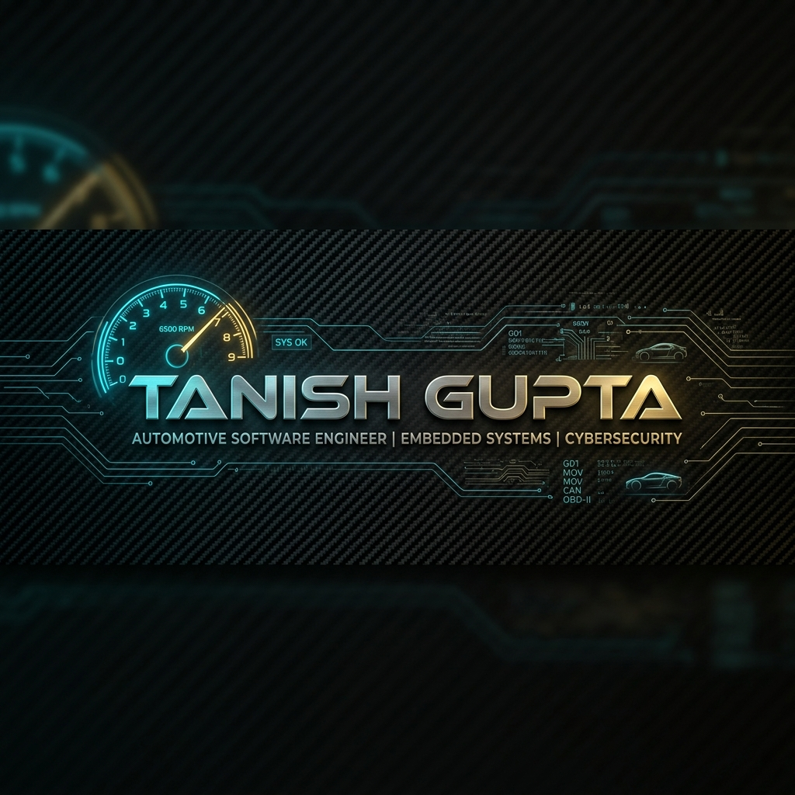

<div align="center">
  <!-- Ultra-Cool Custom Header Banner Image -->
  

  <br/><br/>

  <p align="center">
    <code>AI ENGINEER</code> &bull; <code>FULL-STACK BACKEND ARCHITECT</code> &bull; <code>COMPUTER ENGINEERING STUDENT</code>
  </p>

  <p align="center">
    Building scalable AI-powered applications, backend systems, and secure enterprise infrastructure.
  </p>

  <br/>

  <!-- Unified Social & Profile Views Row -->
  <p align="center">
    <a href="https://www.linkedin.com/in/tanish-gupta-03400730b" target="_blank">
      
    </a>
    &nbsp;
    <a href="mailto:tanishgupta2326@gmail.com">
      
    </a>
    &nbsp;
    <a href="https://github.com/PistonPulse">
      
    </a>
    &nbsp;
    
  </p>

</div>

---

### 💻 Code Manifesto

```javascript
// drive. code. repeat.
import { speed } from 'passion';
import { drive } from 'soul';

function buildGreatThings() {
  focus();
  code();
  coffee();
  repeat();
}

while (alive) {
  learn();
  build();
  ship();
}
```

---

## ⚡ Overview & Core Competencies

<table width="100%">
  <tr>
    <td width="50%" valign="top">
      <h4>Background &amp; Credentials</h4>
      <ul>
        <li><b>Education:</b> B.Tech in Computer Engineering @ K. J. Somaiya School of Engineering (Graduating 2027)</li>
        <li><b>Industry Experience:</b> Ex-Intern @ Capgemini &amp; Tata Communications</li>
        <li><b>Certification:</b> Microsoft Certified: Azure AI Apps and Agents Developer Associate</li>
        <li><b>Location:</b> Mumbai, India</li>
      </ul>
    </td>
    <td width="50%" valign="top">
      <h4>Primary Technical Focus</h4>
      <ul>
        <li><b>Agentic AI:</b> Multi-Agent Systems &amp; Autonomous Workflows</li>
        <li><b>AI Security:</b> LLM Red Teaming &amp; Vulnerability Testing (Microsoft PyRIT)</li>
        <li><b>Backend Engineering:</b> High-Throughput REST APIs (FastAPI &amp; Node.js)</li>
        <li><b>RAG Pipelines:</b> Retrieval-Augmented Generation &amp; Vector Databases</li>
      </ul>
    </td>
  </tr>
</table>

<br/>

<div align="center">
  
  &nbsp;
  
  &nbsp;
  
  &nbsp;
  
  &nbsp;
  
  &nbsp;
  
</div>

<br/>

---

## 🏆 Microsoft Certification Highlight

<table width="100%">
  <tr>
    <td align="center" width="16%">
      
    </td>
    <td>
      <h3>Microsoft Certified: Azure AI Apps and Agents Developer Associate</h3>
      <p>Validates expertise in designing, building, and deploying enterprise AI solutions, Agentic AI workflows, Computer Vision, Text Analytics, and Azure AI infrastructure.</p>
    </td>
  </tr>
</table>

<br/>

---

## 💼 Professional Experience

<table width="100%">
  <tr>
    <td width="100%">
      <h3>Capgemini Technology Services India &nbsp;|&nbsp; <code>Digital Analyst Intern</code></h3>
      <p><b>May 2026 – July 2026</b></p>
      <ul>
        <li>Developed an enterprise <b>AI Security Testing Platform</b> evaluating LLMs against security vulnerabilities.</li>
        <li>Integrated <b>Microsoft PyRIT (Python Risk Identification Tool)</b> to automate AI red teaming workflows.</li>
        <li>Automated security test suites for Prompt Injection, Jailbreak Attacks, Information Leakage, Hallucinations, and Toxicity.</li>
        <li>Built high-performance REST APIs with <b>FastAPI</b> and an interactive dashboard in <b>React</b>.</li>
      </ul>
      <p>
        <b>Tech Stack:</b> 
        <code>Python</code> • <code>FastAPI</code> • <code>React</code> • <code>Microsoft PyRIT</code> • <code>Groq</code> • <code>Llama 3.1</code> • <code>REST APIs</code>
      </p>
    </td>
  </tr>
  <tr>
    <td width="100%">
      <h3>Tata Communications Ltd. &nbsp;|&nbsp; <code>Project Trainee (AIOps)</code></h3>
      <p><b>May 2025 – July 2025</b></p>
      <ul>
        <li>Developed a secure enterprise automation system processing server command requests via email.</li>
        <li>Engineered an NLP pipeline using <b>spaCy</b> and <b>Mistral LLM</b> to extract intent and operational entities from email content.</li>
        <li>Integrated <b>Microsoft Graph API</b> to automate email processing, administrator approvals, and command execution monitoring.</li>
        <li>Built a real-time risk classification engine to evaluate server operations safety prior to execution.</li>
      </ul>
      <p>
        <b>Tech Stack:</b> 
        <code>Python</code> • <code>spaCy</code> • <code>Mistral LLM</code> • <code>Microsoft Graph API</code> • <code>BeautifulSoup</code> • <code>JSON</code>
      </p>
    </td>
  </tr>
</table>

<br/>

---

## 🚀 Featured Projects

<table width="100%">
  <tr>
    <td width="50%" valign="top">
      <h3>TataSmartAgent</h3>
      <p><b>Agentic AI Loan Underwriting Platform &bull; EY Techathon</b></p>
      <p>Multi-agent AI platform simulating complete NBFC loan approval workflows with specialized agents for verification, eligibility, and risk scoring.</p>
      <p><b>Tech Stack:</b> <code>React</code> <code>FastAPI</code> <code>Python</code> <code>Gemini</code> <code>MongoDB</code> <code>Firebase</code></p>
      <p>
        <a href="https://github.com/PistonPulse/TataSmartAgent"></a>
        &nbsp;
        <a href="https://ey-project-production-p8ym.vercel.app/"></a>
      </p>
    </td>
    <td width="50%" valign="top">
      <h3>NeerNiti</h3>
      <p><b>AI Decision Support Platform &bull; SIH 2025</b></p>
      <p>Bilingual AI groundwater decision support system combining Hybrid RAG with official government datasets for district &amp; taluka-level recommendations.</p>
      <p><b>Tech Stack:</b> <code>React</code> <code>FastAPI</code> <code>Python</code> <code>Gemini</code> <code>Cohere</code> <code>ChromaDB</code></p>
      <p>
        <a href="https://github.com/PistonPulse/NeerNiti"></a>
        &nbsp;
        <a href="https://neerniti-one.vercel.app/"></a>
      </p>
    </td>
  </tr>
  <tr>
    <td width="50%" valign="top">
      <h3>WebInspect</h3>
      <p><b>AI-Powered Website Audit Platform</b></p>
      <p>Full-stack website auditing platform evaluating SEO, accessibility, performance, and readability with Gemini-generated fix playbooks.</p>
      <p><b>Tech Stack:</b> <code>React</code> <code>Vite</code> <code>Node.js</code> <code>Express</code> <code>MongoDB</code> <code>Puppeteer</code></p>
      <p>
        <a href="https://github.com/PistonPulse/WebInspect"></a>
        &nbsp;
        <a href="https://web-inspect-production.vercel.app/"></a>
      </p>
    </td>
    <td width="50%" valign="top">
      <h3>RupeeReady AI</h3>
      <p><b>AI Financial Coach &bull; Mumbai Hacks</b></p>
      <p>AI financial assistant tailored for India's gig economy featuring real-time Safe-to-Spend calculations and Smart Tax Vault.</p>
      <p><b>Tech Stack:</b> <code>React</code> <code>Vite</code> <code>Tailwind</code> <code>Framer Motion</code> <code>Recharts</code> <code>Gemini</code></p>
      <p>
        <a href="https://github.com/PistonPulse/RupeeReady-AI"></a>
        &nbsp;
        <a href="https://rupeeready.web.app/"></a>
      </p>
    </td>
  </tr>
  <tr>
    <td colspan="2" width="100%" valign="top">
      <h3>Secure Voting Application</h3>
      <p><b>Enterprise Web Security &amp; Auth System</b></p>
      <p>Hardened polling platform demonstrating modern web security controls, JWT authentication, CSRF defense, and rate limiting.</p>
      <p><b>Tech Stack:</b> <code>Node.js</code> • <code>Express.js</code> • <code>MongoDB</code> • <code>Helmet.js</code> • <code>JWT</code></p>
      <p>
        <a href="https://github.com/PistonPulse/Secure-Voting-Application"></a>
        &nbsp;
        <a href="https://secure-voting-app.onrender.com/"></a>
      </p>
    </td>
  </tr>
</table>

<br/>

---

## 🛠️ Tech Stack &amp; Tools

<p align="center">
  
</p>

---

## 📊 GitHub Analytics

<div align="center">
  
</div>

<br/>

<div align="center">
  
</div>

<br/>

---

## 🤝 Connect With Me

<p align="center">
  <a href="https://www.linkedin.com/in/tanish-gupta-03400730b" target="_blank">
    
  </a>
  &nbsp;&nbsp;
  <a href="mailto:tanishgupta2326@gmail.com">
    
  </a>
  &nbsp;&nbsp;
  <a href="https://github.com/PistonPulse">
    
  </a>
</p>

<br/>

<div align="center">
  <p><i>"drive. code. repeat."</i></p>
  <p>© 2026 Tanish Gupta &bull; PistonPulse</p>
</div>
