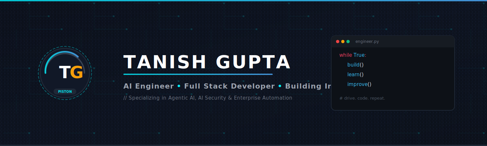

<div align="center">

  <!-- 1. Hero Banner (Custom SVG with Carbon Fiber & Code Snippet) -->
  

  <br/><br/>

  <!-- 2. Animated Typing -->
  <p align="center">
    <a href="https://readme-typing-svg.demolab.com">
      
    </a>
  </p>

  <br/>

  <!-- 3. Quick Profile Cards -->
  <p align="center">
    <code>🏢 Capgemini</code> &nbsp;&bull;&nbsp; 
    <code>☁️ Microsoft Certified</code> &nbsp;&bull;&nbsp; 
    <code>🎓 KJ Somaiya</code> &nbsp;&bull;&nbsp; 
    <code>📍 Mumbai</code> &nbsp;&bull;&nbsp; 
    <code>🚀 Open to 2027 Opportunities</code>
  </p>

  <br/>

  <!-- 14. Connect Buttons -->
  <p align="center">
    <a href="https://www.linkedin.com/in/tanish-gupta-03400730b" target="_blank">
      
    </a>
    &nbsp;&nbsp;
    <a href="https://ey-project-production-p8ym.vercel.app/" target="_blank">
      
    </a>
    &nbsp;&nbsp;
    <a href="mailto:tanishgupta2326@gmail.com">
      
    </a>
  </p>

</div>

---

## 👨‍💻 About Me

I enjoy building AI-powered products, scalable backend systems, and secure enterprise applications.

#### Currently Exploring
- 🤖 **Agentic AI** &amp; Autonomous Workflows
- 🛡️ **AI Security** &amp; LLM Red Teaming
- ⚡ **Distributed Systems** &amp; Backend Engineering
- ☁️ **Azure AI** &amp; Cloud Infrastructure
- 🔍 **Retrieval-Augmented Generation (RAG)**

> *Outside coding, you'll probably find me watching Formula 1, Top Gear, or working on automotive content.*

---

## 🏅 Certification Showcase

<div align="center">
  <table width="100%">
    <tr>
      <td align="center" width="18%">
        <a href="https://learn.microsoft.com/en-us/users/tanishgupta-4210/credentials/e18c356f61ba4415" target="_blank">
          
        </a>
      </td>
      <td>
        <h3>
          <a href="https://learn.microsoft.com/en-us/users/tanishgupta-4210/credentials/e18c356f61ba4415" target="_blank">
            🏅 Microsoft Certified: Azure AI Apps and Agents Developer Associate ↗
          </a>
        </h3>
        <p><b>Verified Skills:</b></p>
        <p>
          <code>✓ Agentic AI</code> &nbsp;&bull;&nbsp; 
          <code>✓ Azure AI</code> &nbsp;&bull;&nbsp; 
          <code>✓ Computer Vision</code> &nbsp;&bull;&nbsp; 
          <code>✓ Text Analytics</code> &nbsp;&bull;&nbsp; 
          <code>✓ Information Extraction</code>
        </p>
        <p>
          <a href="https://learn.microsoft.com/en-us/users/tanishgupta-4210/credentials/e18c356f61ba4415" target="_blank">
            
          </a>
        </p>
      </td>
    </tr>
  </table>
</div>

---

## 💼 Professional Experience Timeline

<div align="center">

```
  2025
   │
   ├── 🏢 Tata Communications (Project Trainee - AIOps)
   │     └── Built NLP & server command automation platform using spaCy & Mistral
   │
   ├── 🏆 Smart India Hackathon 2025
   │     └── Qualified College Round with NeerNiti AI Groundwater Platform
   │
  2026
   │
   ├── 🏢 Capgemini Technology Services (Digital Analyst Intern)
   │     └── Engineered SentinelAI AI Security & PyRIT Red Teaming platform
   │
   └── 🏅 Microsoft Certification
         └── Azure AI Apps and Agents Developer Associate Certified
```

</div>

---

## 🚀 Featured Projects

### 🏦 TataSmartAgent
> **Agentic AI Loan Underwriting Platform &bull; EY Techathon**
>
> Multi-agent AI platform simulating complete NBFC loan approval workflows with specialized agents for verification, eligibility assessment, and risk scoring.

`React` &bull; `FastAPI` &bull; `Gemini` &bull; `MongoDB`

[🚀 Live Demo](https://ey-project-production-p8ym.vercel.app/) &nbsp;&nbsp;|&nbsp;&nbsp; [📦 Repository](https://github.com/PistonPulse/TataSmartAgent)

<br/>

### 🌍 NeerNiti
> **AI Decision Support Platform &bull; Smart India Hackathon 2025**
>
> Bilingual AI groundwater decision platform combining Hybrid RAG with official government datasets for district &amp; taluka-level recommendations.

`React` &bull; `FastAPI` &bull; `Gemini` &bull; `ChromaDB`

[🚀 Live Demo](https://neerniti-one.vercel.app/) &nbsp;&nbsp;|&nbsp;&nbsp; [📦 Repository](https://github.com/PistonPulse/NeerNiti)

<br/>

### 🔍 WebInspect
> **AI-Powered Website Audit Platform**
>
> Full-stack website auditing platform evaluating SEO, accessibility, performance, and readability with Gemini-generated optimization playbooks.

`React` &bull; `Node.js` &bull; `Gemini` &bull; `Puppeteer`

[🚀 Live Demo](https://web-inspect-production.vercel.app/) &nbsp;&nbsp;|&nbsp;&nbsp; [📦 Repository](https://github.com/PistonPulse/WebInspect)

<br/>

### 💡 RupeeReady AI
> **AI Financial Coach &bull; Mumbai Hacks**
>
> AI financial assistant tailored for India's gig economy featuring real-time Safe-to-Spend calculations and Smart Tax Vault.

`React` &bull; `Tailwind` &bull; `Framer Motion` &bull; `Gemini`

[🚀 Live Demo](https://rupeeready.web.app/) &nbsp;&nbsp;|&nbsp;&nbsp; [📦 Repository](https://github.com/PistonPulse/RupeeReady-AI)

<br/>

### 🛡️ Secure Voting Application
> **Enterprise Web Security &amp; Auth System**
>
> Hardened polling platform demonstrating modern web security controls, JWT authentication, CSRF defense, and rate limiting.

`Node.js` &bull; `Express` &bull; `MongoDB` &bull; `Helmet`

[🚀 Live Demo](https://secure-voting-app.onrender.com/) &nbsp;&nbsp;|&nbsp;&nbsp; [📦 Repository](https://github.com/PistonPulse/Secure-Voting-Application)

---

## 🛠️ Tech Stack

#### Languages


#### Artificial Intelligence

<p>
  <code>Google Gemini</code> &bull; 
  <code>Microsoft PyRIT</code> &bull; 
  <code>spaCy</code> &bull; 
  <code>Mistral LLM</code> &bull; 
  <code>RAG &amp; ChromaDB</code>
</p>

#### Backend


#### Frontend


#### Database


---

## 🏆 GitHub Achievements

<p align="left">
  
</p>

---

## 📊 GitHub Stats &amp; Analytics

<div align="center">
  
</div>

<br/>

<div align="center">
  
</div>

---

## ⭐ Beyond Code

- 🏎️ **Formula 1**
- 🚗 **Automotive Engineering**
- 🎥 **Content Creation**
- 📷 **Photography**
- 🎬 **Cinematic Editing**
- ☕ **Coffee**

---

<br/>

<div align="center">
  <p><i>"Building software with the precision of engineering and the curiosity of exploration."</i></p>
  <p>© 2026 Tanish Gupta &bull; PistonPulse</p>
</div>

<div align="right">
  
</div>
